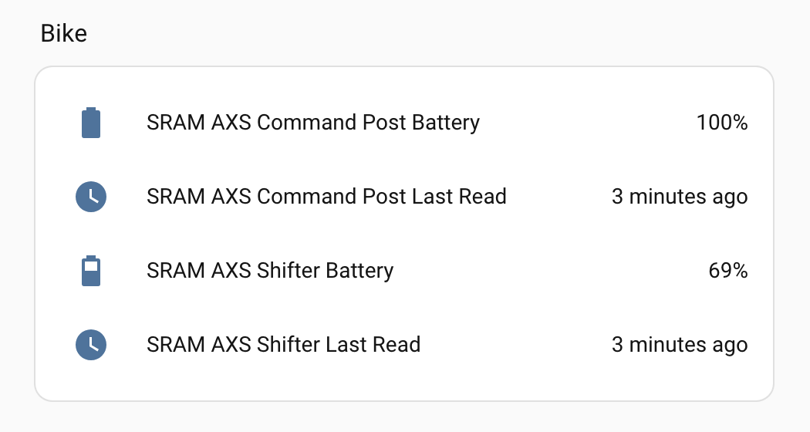

# SRAM AXS for Home Assistant

A custom Home Assistant integration that reads battery status from SRAM AXS components (shifter, command post/dropper post) via Bluetooth Low Energy.



## Features

- **Battery level** sensor (%) for each paired component
- **Last Read** timestamp sensor showing when the value was last fetched from the device
- Values persist across HA restarts — shows last known reading until the bike is in range again
- Event-driven: reads trigger when the component wakes up (button press), not on a fixed timer
- Auto-discovery: HA detects SRAM AXS devices automatically when they are in BLE range

## Supported components

Any SRAM AXS component that exposes the standard BLE Battery Service should work. Confirmed working:

- AXS Command Post (dropper post controller)
- AXS Shifter (road/gravel)

## Requirements

- Home Assistant with Bluetooth support (Raspberry Pi built-in BT, or a USB BLE adapter)
- SRAM AXS components within BLE range of the HA host (~5–10m line of sight; walls reduce range)
- No ANT+ dongle or additional hardware needed

> **Tip:** If your bike is stored in a garage or room with poor BLE coverage, an [ESPHome Bluetooth proxy](https://esphome.io/components/bluetooth_proxy.html) on an ESP32 (~€5–10) placed near the bike dramatically improves connection reliability.

## Installation

1. Copy the `custom_components/sram_axs/` folder into your HA `config/custom_components/` directory.
2. Restart Home Assistant.

### Using the deploy script

If you have SSH access to your HA host:

```bash
./deploy.sh <user> <host>
# e.g. ./deploy.sh homeassistant homeassistant.local
```

Then restart HA or reload the integration.

## Configuration

1. Wake your SRAM AXS components by pressing a button on each one.
2. In HA go to **Settings → Devices & Services**.
3. A discovery notification for *SRAM AXS* should appear automatically. If not, click **Add Integration** and search for *SRAM AXS*.
4. The setup wizard will ask what type of component it is (Shifter, Command Post, etc.).
5. Repeat for each component.

## How it works

SRAM AXS components expose a standard Bluetooth GATT Battery Service (`0x180F`) alongside several proprietary SRAM services. This integration reads the Battery Level characteristic (`0x2A19`) which returns a value from 0–100.

Components only broadcast BLE advertisements when awake (after a button press). The integration registers a callback for each device's BLE address and connects to read the battery level whenever an advertisement is detected — no polling timer is used. The debounce window is 5 minutes, so rapid button presses only trigger one read per session.

## Dashboard card

Add this to your Lovelace dashboard to see all components at a glance:

```yaml
type: entities
title: Bike
entities:
  - entity: sensor.sram_axs_command_post_battery
  - entity: sensor.sram_axs_command_post_last_read
  - entity: sensor.sram_axs_shifter_battery
  - entity: sensor.sram_axs_shifter_last_read
```

## Low battery automation example

```yaml
automation:
  - alias: "Warn when SRAM battery is low"
    trigger:
      - platform: numeric_state
        entity_id:
          - sensor.sram_axs_command_post_battery
          - sensor.sram_axs_shifter_battery
        below: 20
    action:
      - service: notify.mobile_app
        data:
          message: "{{ trigger.to_state.name }} is at {{ trigger.to_state.state }}%"
```

## Roadmap

- [ ] Explore SRAM proprietary BLE services for additional data (gear position, shift count, post position) via HCI snoop log analysis
- [ ] HACS support
- [ ] HA repair issues for critically low battery

## Contributing

Open source, non-commercial. PRs and issues welcome.

## License

MIT
